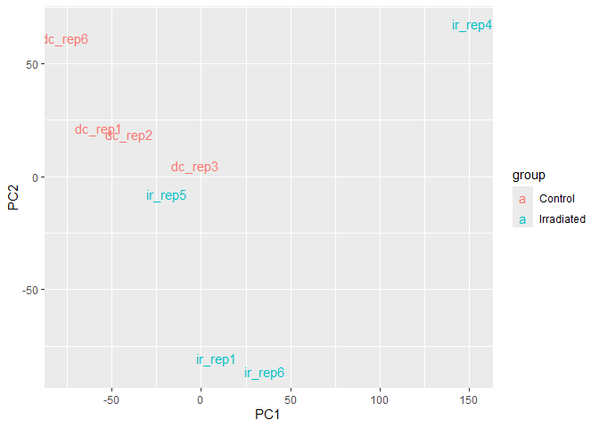
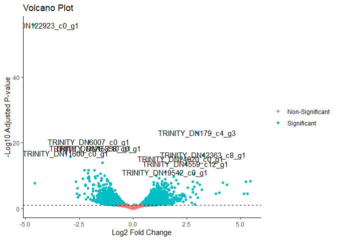
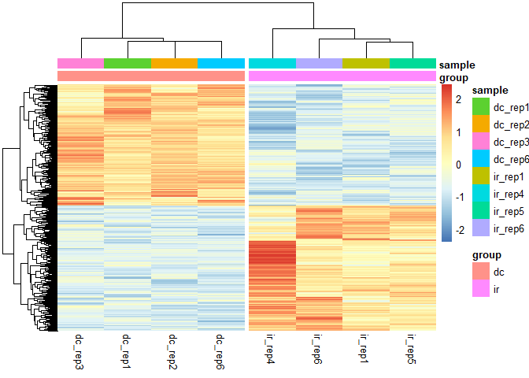

# RNA_seq
Jeronimo Miranda Rodriguez

## Cargando librerias

Este tutorial esta basado en el libro Akalin (2020) que esta disponible
en [Computational Biology with R](https://compgenomr.github.io/book/).
Este libro es un muy buen recurso para profundizar en sus conocimientos
de R y su uso para la genomica en ambitos que no veremos en el curso.

``` r
library(readr)
library(dplyr)
library(tidyr)
library(magrittr)
library(stringr)
library(tximport)
library(stats)
library("RColorBrewer")
library(ggplot2)
library(ggfortify)
```

## Cargando archivos

#### Cargar los datos directo del output de kallisto con tximport

En el archivo `all_samples.txt` esta la informacion de los nombres de
cada muestra y a cual grupo experimental pertenecen

``` r
colData <- read_delim("rna-seq/all_samples.txt", 
                      delim = "\t", escape_double = FALSE, 
                      col_names = FALSE, trim_ws = TRUE)

#Nombramos las columnas para que no se llamen X1 y X2
colData <- colData[,1:2]
colnames(colData) <- c("group", "sample")

#El archivo tiene la info completa de dos experimentos distintos
#Aqui solo usaremos los irradiados "ir" y sus controles "dc"
colData %<>% filter(group %in% c("dc", "ir"))
rnames <- colData$sample
colData <- as.data.frame(colData$group, row.names = rnames)
colnames(colData) <- c("group")
```

Usando los nombres contenidos en `colData` cargamos el archivo
`abundance.tsv` para cada muestra.

Cargamos el archivo geneLengths porque necesitamos la informacion con la
correspondencia gen-transcrito. Este archivo lo procesamos para que
tx2gene tenga esta info

``` r
files <- file.path("rna-seq", rownames(colData), "abundance.tsv")
names(files) <- rownames(colData)

geneLengths <- read_delim("transcript_lengths.tsv",
                          delim = "\t", escape_double = FALSE, 
                          trim_ws = TRUE)
```

    Rows: 464338 Columns: 3
    ── Column specification ────────────────────────────────────────────────────────
    Delimiter: "\t"
    chr (2): transcript_id, trinity_len
    dbl (1): sequence_length

    ℹ Use `spec()` to retrieve the full column specification for this data.
    ℹ Specify the column types or set `show_col_types = FALSE` to quiet this message.

``` r
tx2gene <- transmute(geneLengths, transcript_id, gene_id = str_remove(transcript_id, "_i[0-9]+"))


counts <- tximport(files, type = "kallisto", tx2gene = tx2gene, ignoreAfterBar = TRUE)
```

    Note: importing `abundance.h5` is typically faster than `abundance.tsv`
    reading in files with read_tsv
    1 2 3 4 5 6 7 8 9 10 
    summarizing abundance
    summarizing counts
    summarizing length

La counts\$counts tiene la matriz con los conteos estimados de kallisto.
Asimismo, counts\$lengths tiene una estimacion de las longitudes de los
transcritos, que nos sirve para normalizar como TPM y RPKM.

#### Mas sobre tximport

El paquete de analisis de expresion diferencial DESeq2 trabaja mejor con
datos a nivel gen, pero los programas como kallisto, salmon y otros
cuantifican a nivel transcrito. En cualquier caso, es buena idea
importar los datos a traves de **tximport** En este link hay mas
informacion sobre como cargar los datos desde diferentes programas de
cuantificacion y como utilizarlos con DESeq2, edgeR o limma-voom

[tximport](https://bioconductor.org/packages/release/bioc/vignettes/tximport/inst/doc/tximport.html)

## Distintas maneras de normalizar transcritos

#### Conteos por millon

La forma mas simple de normalizar es dividir los conteos de cada gen por
el numero total de conteos. Asi, para cada muestra, la suma de los cpm
es 1. Este numero por convencion se multiplica por un millon. Asi, se
normalizan los datos corrigiendo diferencias en el taman~o de la
libreria o la profundidad de secuenciacion. Otras opciones de
normalizacion son dividir no por la suma sino por el valor del cuartil
superior o de la media.

$$
cpm = \frac{conteo_{gen^i}}{total}*10^{6}
$$

``` r
#Counts per million
cpm <- apply(counts$counts, 2, function(x) x/sum(as.numeric(x)) * 10^6)
#La suma de todas las columnas es 1 millon
colSums(cpm)
```

    dc_rep1 dc_rep2 dc_rep3 dc_rep4 dc_rep6 ir_rep1 ir_rep4 ir_rep5 ir_rep6 ir_rep7 
      1e+06   1e+06   1e+06   1e+06   1e+06   1e+06   1e+06   1e+06   1e+06   1e+06 

#### Fragmentos por kilobase de millones de reads (FPKM)

Aqui, el CPM se divide por otro factor, que es la longitud del gen en
unidades de kilobases. Esta normalizacion tambien corrige que los genes
mas largos daran mas conteos.

$$
FPKM = \frac{\frac{conteo_{gen^i}}{total}*10^{6}}{\frac{largo_{gen^i}}{1000}}= \frac{10^9 *  conteo_{gen^i}}{total*largo_{gen^i}}
$$

``` r
#Computar RPKM
#Vector de longitudes
rpkm <-  apply(counts$counts, MARGIN = 2, FUN = function(x){
  10^9 * x / sum(as.numeric(x)) / counts$length  
})

#Las suma de las columnas no son iguales
rpkm %>% colSums()
```

     dc_rep1  dc_rep2  dc_rep3  dc_rep4  dc_rep6  ir_rep1  ir_rep4  ir_rep5 
     9416170  9319382  9338847 11053736  9390908  9451093 10433185  9291354 
     ir_rep6  ir_rep7 
     9639737 11566170 

#### Transcritos por millon

Esta normalizacion es la misma idea que FPKM pero la division por la
longitud se hace primero y solo posteriormente se hace la normalizacion
por el tamano dd la libreria. Asi, el total de los TPM de una libreria
vuelve a sumar 1 millon y es mas intuitivo de entender.

$$
TPM = \frac{\frac{conteo_{gen^i}}{(\frac{largo_{gen^i}}{1000})}}{total*10^{6}} 
$$

``` r
#TPM
tpm <- counts$counts /counts$length/1000
tpm <- apply(tpm, 2, function(x){x/sum(x) * 10^6})

#La suma si es un millon
tpm %>%colSums()
```

    dc_rep1 dc_rep2 dc_rep3 dc_rep4 dc_rep6 ir_rep1 ir_rep4 ir_rep5 ir_rep6 ir_rep7 
      1e+06   1e+06   1e+06   1e+06   1e+06   1e+06   1e+06   1e+06   1e+06   1e+06 

## Analisis exploratorio de la tabla de conteos

Ahora tenemos una matriz de TPM en donde las columnas corresponden a las
diferentes muestras y las filas a diferentes genes. Al calcular la
varianza de cada fila, estamos calculando cuanto varia la expresion de
cada gen en las distintas muestras. Usaremos los 100 genes con mayor
varianza para visualizar nuestros datos en una matriz o mapa de calor.

``` r
library(pheatmap)
#calcular la varianza
V <- tpm %>% apply(1, var)


#Los nombres de los 100 genes con la mayor varianza
selectedGenes <- names(V[order(V, decreasing = T)][1:100])

colData_df <- mutate(colData, sample = rownames(colData))
#Usar estos genes para explorar los datos                 
tpm[selectedGenes,] %>% pheatmap(scale = "row", show_rownames = F,
                                annotation_col = colData,
                                cutree_cols = 2)
```


En este analisis preeliminar de los datos, es obvio que cuatro controles
se agrupan, asi como cuatro muestras experimentales. Sin embargo,
dc_rep4 e ir_rep7 se apartan de las demas. Esto puede deberse a
variabilidad inherente a cada muestra durante el proceso experimental,
la secuenciacion u otros factores. Aunque hay maneras de corregir esta
varianza inesperada, para este ejercicio, simplemente eliminaremos estas
dos muestras.

#### Analisis de componentes principales

Aqui tambien es obvio que ambas muestras son *outliers* sobre el
componente principal 1, que explica el 60% de la varianza. Este es un
buen argumento para excluirlas de los siguientes analisis.

``` r
M <- t(tpm)
#Por que se usa el +1?
M <- log2(M + 1)

pcaResults <- prcomp(M)
autoplot(pcaResults, data = colData, colour = 'group')
```


``` r
#Con ggplot
pcaResults$x %>% as_tibble() %>% 
  mutate(samples = rownames(pcaResults$x), 
         group = if_else(str_detect(samples,"dc"), "Control", "Irradiated")) %>%
  ggplot(aes(PC1,PC2)) + geom_text(aes(label=samples, col = group))
```


## Filtrar los datos raros

Vamos a quitar las dos muestras tanto de la tabla de agrupacion
experimental `colData` como de cada matriz del objeto txi `counts`.

``` r
#Algo raro con las muestras?
colData <- colData %>% mutate(sample = rownames(colData)) %>%
  filter(!(sample %in% c("dc_rep4", "ir_rep7")))
#Remove samples
counts$abundance <- counts$abundance[,-c(4,10)]
counts$counts <- counts$counts[,-c(4,10)]
counts$length <- counts$length[,-c(4,10)]

tpm <- tpm[,-c(4,10)]
```

Inmediatamente podemos ver una mejora en el clustering de los datos

``` r
M <- t(tpm)
#Por que se usa el +1?
M <- log2(M + 1)

pcaResults <- prcomp(M)
#Con ggplot
pcaResults$x %>% as_tibble() %>% 
  mutate(samples = rownames(pcaResults$x), 
         group = if_else(str_detect(samples,"dc"), "Control", "Irradiated")) %>%
  ggplot(aes(PC1,PC2)) + geom_text(aes(label=samples, col = group))
```



## DESeq2 para analisis diferencial

### Importar los datos a DESeq2

Para importar nuestros datos a un objeto de la libreria DESeq2, es
practico hacerlo a partir del objeto tximport que creamos al principio
de la practica. La funcion `DESeqDataSetFromTximport` toma un objeto
txi, la informacion experimento/muestra contenida en `colData` y una
formula de R que nos diga de que variables pensamos que depende la
variacion, en este caso, el grupo.

``` r
library(DESeq2)
#Formula
designFormula <- "~group"
#Convertirmatriz a un objeto DESeq
dds <- DESeqDataSetFromTximport(txi = counts,
                              colData = colData,
                              design = as.formula(designFormula))
```

Aunque tambien podemos obtener un objeto a partir de una matriz o un
objeto `SummarizedExperiment`, como nos avisa el mensaje, al importar
con tximport, DESeq2 automaticamente tomara en cuenta la informacion del
largo de los transcritos.

### Filtrado preeliminar

Es practica comun eliminar los genes con pocos conteos, o que tengan un
conteo de 0 en una proporcion importante de las muestras. La razon es
que estos genes tienen poca informacion estadistica y quitarlos acelera
los computos subsecuentes.

En este codigo estamos filtrando los genes que no tengan mas de 10
cuentas entre todas las muestras. La segunda linea deja solo los genes
que tengan al menos 1 conteo en al menos 5 muestras.

``` r
message("Antes del filtrado: "); nrow(dds)
```

    Antes del filtrado: 

    [1] 357706

``` r
#Cuales tienen al menos un conteo 10 conteos
dds <- dds[rowSums(DESeq2::counts(dds)) > 10,]
#Genes con al menos un conteo en al menos 4 muestras
dds <- dds[rowSums(DESeq2::counts(dds) != 0) >4,]
message("Despues del filtrado: "); nrow(dds)
```

    Despues del filtrado: 

    [1] 178513

### Workflow estandar de DESeq2

`DESeq` es la funcion magica del paquete que lleva a cabo la
transformacion de los conteos y su modelado.

``` r
#Aplicar el workflow deseq
dds <- DESeq(dds)
```

    estimating size factors

    using 'avgTxLength' from assays(dds), correcting for library size

    estimating dispersions

    gene-wise dispersion estimates

    mean-dispersion relationship

    final dispersion estimates

    fitting model and testing

Como puedes ver, la funcion `DESeq` lleva a cabo al menos 3 pasos:

1.  Estimar factores de tamano. [^1]

2.  Estimar dispersiones. [^2]

3.  Hacer un ajuste de los conteos con un modelo de distribucion
    discreta [^3]

Podemos obtener la informacion de estos tests estadisticos con la
funcion `results` aplicada al objetdo `dds`

``` r
DEresults = results(dds, contrast = c("group", "ir", "dc"))
DEresults <- DEresults[order(DEresults$pvalue),]
head(DEresults)
```

    log2 fold change (MLE): group ir vs dc 
    Wald test p-value: group ir vs dc 
    DataFrame with 6 rows and 6 columns
                            baseMean log2FoldChange     lfcSE      stat      pvalue
                           <numeric>      <numeric> <numeric> <numeric>   <numeric>
    TRINITY_DN122923_c0_g1   489.656       -4.63528  0.280337 -16.53470 2.06408e-61
    TRINITY_DN179_c4_g3      334.256        3.04068  0.275236  11.04754 2.25301e-28
    TRINITY_DN6007_c0_g1     545.587       -2.09214  0.200094 -10.45578 1.37855e-25
    TRINITY_DN378_c10_g1     421.232       -2.02683  0.203418  -9.96390 2.19296e-23
    TRINITY_DN15858_c0_g1   1672.915       -1.64663  0.165349  -9.95847 2.31604e-23
    TRINITY_DN11600_c0_g1    163.793       -3.19541  0.333482  -9.58196 9.52172e-22
                                  padj
                             <numeric>
    TRINITY_DN122923_c0_g1 1.68295e-56
    TRINITY_DN179_c4_g3    9.18494e-24
    TRINITY_DN6007_c0_g1   3.74666e-21
    TRINITY_DN378_c10_g1   3.77676e-19
    TRINITY_DN15858_c0_g1  3.77676e-19
    TRINITY_DN11600_c0_g1  1.29392e-17

Esta grafica nos ayuda a explorar la distribucion de los datos. Vemos
que la mayoria de los genes estan cerca de 0, es decir, la mayoria de
los genes permanece sin cambio. Los puntos azules son los genes
significativamente desregulados al alza o a la baja.

``` r
DESeq2::plotMA(dds, ylim = c(-2,2))
```


Aun asi, se nota que los genes con baja expresion tienen mayor valor
absoluto de log fold change. Esto no es ideal para visualizar o para
seleccionar genes, pues al ordenarlos de acuerdo al tamano del efecto,
tendremos un sesgo hacia genes con mas baja expresion. En consecuencia,
es util “encoger” el log fold change para efectos de visualizacion y
seleccion.

``` r
resultsNames(dds)
```

    [1] "Intercept"      "group_ir_vs_dc"

``` r
resLFC <- lfcShrink(dds, coef = "group_ir_vs_dc", type = "apeglm")
```

    using 'apeglm' for LFC shrinkage. If used in published research, please cite:
        Zhu, A., Ibrahim, J.G., Love, M.I. (2018) Heavy-tailed prior distributions for
        sequence count data: removing the noise and preserving large differences.
        Bioinformatics. https://doi.org/10.1093/bioinformatics/bty895

    Warning in nbinomGLM(x = x, Y = YNZ, size = size, weights = weightsNZ, offset =
    offsetNZ, : the line search routine failed, unable to sufficiently decrease the
    function value

``` r
DESeq2::plotMA(resLFC, ylim = c(-2,2))
```


Asi, vemos un poco atemperada la magnitud de logfold change asociado a
los conteos bajos.

Otra prueba diagnostica es mirar la distribucion de los p-valores antes
del ajuste. Vemos un enriquecimiento hace p-valores bajos y una
distribucion uniforme

``` r
ggplot(as.data.frame(DEresults), aes(x=pvalue)) + geom_histogram(bins = 100)
```

    Warning: Removed 76 rows containing non-finite outside the scale range
    (`stat_bin()`).


``` r
#Coonvertimos a dataframe y quitamos los genes que tienen na en padjusted
volcano_df <- as.data.frame(resLFC) %>% filter(!is.na(padj)) %>% 
  #Hacemos una variable y por simplicidad y una variable que agrupe significancia estadistica
  mutate(y = -log10(padj), significance = ifelse(padj < 0.1, "Significant", "Non-Significant"))

#un dataframe creado para poner etiquetas a genes seleccionados
highlighted_genes <- volcano_df %>% arrange(padj) %>% mutate(gene_id = rownames(.)) %>% group_by(upordown = sign(log2FoldChange)) %>% slice_head(n = 5)
  
p <- ggplot(volcano_df, aes(log2FoldChange, y)) + geom_point(aes(color = significance)) + geom_hline(yintercept = -log10(0.1), linetype = "dashed") + theme_classic() + xlab("Log2 Fold Change") + ylab("-Log10 Adjusted P-value") + ggtitle("Volcano Plot") + labs(color = NULL)

p + annotate("text", x = highlighted_genes$log2FoldChange, y = highlighted_genes$y, label = highlighted_genes$gene_id)
```



## Normalizaciones de los conteos

Aunque DESeq2 trabaja con los conteos crudos y usa su propia
normalizacion interna, para visualizaciones o procedimientos que
requieren datos normalizados, se ofrecen dos algoritmos de normalizacion
alternativos al mas frecuentemente usado que es el log2

``` r
vsd <- varianceStabilizingTransformation(dds, blind = FALSE)
rld <- rlog(dds, blind = FALSE)


df <- bind_rows(
  as_tibble(log2(counts(dds, normalized=TRUE)[, 1:2]+1)) %>%
    mutate(transformation = "log2(x + 1)"),
  as_tibble(assay(vsd)[, 1:2]) %>% mutate(transformation = "vst"),
  as_tibble(assay(rld)[, 1:2]) %>% mutate(transformation = "rlog"))
colnames(df)[1:2] <- c("x", "y") 
lvls <- c("log2(x + 1)", "vst", "rlog")
df$transformation <- factor(df$transformation, levels=lvls)
ggplot(df, aes(x = x, y = y)) + geom_hex(bins = 80) +
  coord_fixed() + facet_grid( . ~ transformation)
```


Tambien podemos comparar como cambia la grafica de PCA con las
diferentes transformaciones

``` r
DESeq2::plotPCA(normTransform(dds), intgroup = "group") + ggtitle("Normalizaacion log2 +1")
```

    using ntop=500 top features by variance


``` r
DESeq2::plotPCA(vsd, intgroup = "group") + ggtitle("Variance stabilizing transformation")
```

    using ntop=500 top features by variance


``` r
DESeq2::plotPCA(rld, intgroup = "group") + ggtitle("Regularized logarithm")
```

    using ntop=500 top features by variance


En este caso no parece cambiar mucho, pero el primer componente
principal de las dos normalizaciones alternativas explica mas de la
varianza. En cualquier caso, los datos se clusterizan mejor que en
nuestro primer intento con TPMs artesanales mas arriba.

### Heatmap

Volvemos a la grafica de heatmap para visualizacion y clustering pero
ahora seleccionando a los genes differencialmente expresados. Primero,
tomamos todos los genes diferencialmente expresados sin importar si son
al alza o a la baja, con un umbral de significancia de 0,05.

``` r
#Genes diferencialmente regulados 
DE <- resLFC[!is.na(resLFC$padj),]
DE <- DE[DE$padj < 0.05,]
DE <- DE[abs(DE$log2FoldChange) > 1,]

diff_exp <- as.data.frame(DE, optional = T) %>% mutate(gene_id = row.names(.))
```

Utilizamos la normalizacion por logaritmo regularizado. Con la funcion
`assay` obtenemos la matriz de conteos normalizados para el objeto en
cuestion.

``` r
assay(rld)[diff_exp$gene_id,] %>% pheatmap(scale = "row", show_rownames = F,
                                annotation_col = colData,
                                cutree_cols = 2)
```



Queda como ejercicio recrear esta grafica con las diferentes
transformaciones `assay(rld)[diff_exp$gene_id,]` ,
`assay(rld)[diff_exp$gene_id,]` ,
`assay(normTransform(dds)[diff_exp$gene_id,]` , y
`tpm[diff_exp$gene_id,]` . Se nota alguna diferencia?

## Enriquecimiento de terminos GO

No solo podemos ver los cambios en genes, sino tambien en grupos de
genes agrupados por ontologias, es decir, funciones moleculares y vias
metabolicas. La libreria `gprofiler2` facilita esto al conectarse con
las bases de datos necesarias para muchos organismos modelo. En nuestro
caso, por trabajar con un organismo modelo, requerimos un poco de
procesamiento de datos para obtener los terminos GO. Iremos paso por
paso:

Para este ejercicio, cargaremos el archivo de trinotate, que utiliza
varios programas para recabar evidencia sobre la funcion de los genes.
En este caso nos interesan principalmente los genes que tienen homologia
con alguna proteina de Swissprot.

``` r
#Cargar el archivo de anotacion
swissprot_trinotate <- read_delim("onlySwissProt_trinotate_annotation_str_withGeneNames.csv", 
                                  delim = "\t", escape_double = FALSE, col_names = FALSE,
                                  na = ".", trim_ws = TRUE)
```

    Rows: 41900 Columns: 18
    ── Column specification ────────────────────────────────────────────────────────
    Delimiter: "\t"
    chr (10): X1, X2, X3, X4, X6, X7, X8, X9, X10, X16
    lgl  (8): X5, X11, X12, X13, X14, X15, X17, X18

    ℹ Use `spec()` to retrieve the full column specification for this data.
    ℹ Specify the column types or set `show_col_types = FALSE` to quiet this message.

``` r
#Esto es solo para quitar automaticamente las columnas vacias
swissprot_trinotate %<>% select(-where(is.logical))
#Le damos los nombres de las columnas
colnames(swissprot_trinotate) <- c("swiss_prot_name", "gene_id", "transcript_id", "sprot_top_blastx_hit", "peptide_id", "proot_coords", "sprot_top_blastp_hit", "pfam", "signalp", "gene_ontology_pfam")
```

Las operaciones del tidyverse son muy convenientes cuando queremos
juntar la informacion de distintas tablas. En este caso, juntamos la
informacion de anotacion en `swissprot_trinotate` que tiene el ID de
swissprot con nuestros genes diferencialmente expresados

``` r
swissprot_trinotate %<>% mutate(swissprot_id = 
         str_extract(sprot_top_blastp_hit,"sp\\|(\\w{6})\\|", group =  1))
#Join with a dataframe of the differentially expressed genes
diff_exp %<>% tibble %>% inner_join(swissprot_trinotate)
```

    Joining with `by = join_by(gene_id)`

Ahora, cargamos la tabla de anotacion de la base de datos UNIPROT, esta
se puede descargar de
[aqui](https://www.uniprot.org/uniprotkb?query=reviewed:true). La
libreria janitor es para homogeneizar rapida y facilmente los nombres de
las columnas.

``` r
library(janitor)
```


    Attache Paket: 'janitor'

    Die folgenden Objekte sind maskiert von 'package:stats':

        chisq.test, fisher.test

``` r
uniprotkb <- read_delim("uniprotkb_reviewed_true_2023_07_11.tsv", 
                                                 delim = "\t", escape_double = FALSE, 
                                                 trim_ws = TRUE)
```

    Rows: 569793 Columns: 13

    ── Column specification ────────────────────────────────────────────────────────
    Delimiter: "\t"
    chr (12): Entry, Reviewed, Entry Name, Protein names, Gene Names, Organism, ...
    dbl  (1): Length

    ℹ Use `spec()` to retrieve the full column specification for this data.
    ℹ Specify the column types or set `show_col_types = FALSE` to quiet this message.

``` r
uniprotkb <- clean_names(uniprotkb)

diff_exp %<>% inner_join(uniprotkb, by = join_by(swissprot_id == entry))
#Esto es solo para quedarnos con el primer match a uniprot
diff_exp %<>% group_by(gene_id) %>% slice_head(n=1)
```

Ahora que juntamos nuestra lista con Uniprot, podemos sacar de aqui el
termino GO asociado con cada gene diferencialmente expresado

``` r
#Lista de genes sobreregulados
genes_interes <- diff_exp %>% filter(!is.na(gene_ontology_go)) %>%
  #extraemos la lista de GO terms con el primer GO predicho para cada gene
  pull(gene_ontology_go) %>% str_extract("GO:\\d+") %>%  unlist
```

Ahora extraemos los terminos GO para el genoma completo, como una
especie de “background” para comparar los genes desregulados.

``` r
bg_go <- swissprot_trinotate %>% 
  inner_join(uniprotkb, by = join_by(swissprot_id == entry)) %>% 
  pull(gene_ontology_go) %>% str_extract("GO:\\d+") %>%  unlist
```

Gprofiler requiere un organismo, utilizamos a bglabrata pues tambien es
un gasteropodo y si se encuentra en su base de datos. Luego, filtramos
con un un *intersection size* relativamente pequeno para quedarnos con
los GO mas especificos y no con los generales como “Citoplasma” o
“membrana plasmatica”.

``` r
library(gprofiler2)

goResults <- gost(query = genes_interes, organism = "bglabrata", custom_bg = bg_go)
```

    Detected custom background input, domain scope is set to 'custom'.

``` r
go <- goResults$result %>% arrange(p_value) %>% filter(intersection_size < 100)
```

Aca se muestran nuestros cinco GO mas enriquecidos en un formato tabla
listo para publicacion.

``` r
publish_gosttable(goResults, highlight_terms = go[1:5,],
                        use_colors = TRUE, 
                        show_columns = c("source", "term_name", "term_size", "intersection_size"),
                        filename = NULL)
```

    The input 'highlight_terms' is a data.frame. The column 'term_id' will be used.


Con la libreria gage, tomamos facilmente un grupo de genes y comparar su
cambio en expresion con con otro grupo. Aqui, tomamos el ultimo de los
GO terms y lo comparamos con un

``` r
library(gage)
```

``` r
for(i in nrow(go):nrow(go)-1){
go_term <- uniprotkb %>% filter(if_any(starts_with("gene_ontology_"), ~ str_detect(.x, go[i,]$term_id)))

go_term %<>% inner_join(swissprot_trinotate, by = join_by(entry == swissprot_id))

geneSet1 <- DEresults %>% as.data.frame %>%
  mutate(gene_id = row.names(.)) %>% 
  filter(gene_id %in% go_term$gene_id) %>% pull(gene_id) %>% unique

normalizedCounts <- assay(vsd)

geneSet2 <- sample(rownames(normalizedCounts), length(geneSet1))

geneSets <- list('top_GO_term' = geneSet1,
                 'random_set' = geneSet2)

message("comparing vs random sample")
print(go[i,]$term_name)
gseaResults <- gage(exprs = log2(normalizedCounts+1),
                    ref = match(rownames(colData[colData$group == "dc",]),
                                colnames(normalizedCounts)),
                    sampe = match(rownames(colData[colData$group== "ir",]),
                                  colnames(normalizedCounts)),
                    gsets = geneSets, compare = 'as.group')
print(i)
print(gseaResults)
}
```

    comparing vs random sample

    [1] "calcium ion transport"
    [1] 83
    $greater
                p.geomean  stat.mean     p.val     q.val set.size      exp1
    top_GO_term 0.2307048 0.73874668 0.2307048 0.4614096       66 0.2307048
    random_set  0.4845530 0.03880476 0.4845530 0.4845530       66 0.4845530

    $less
                p.geomean  stat.mean     p.val     q.val set.size      exp1
    random_set  0.5154470 0.03880476 0.5154470 0.7692952       66 0.5154470
    top_GO_term 0.7692952 0.73874668 0.7692952 0.7692952       66 0.7692952

    $stats
                 stat.mean       exp1
    top_GO_term 0.73874668 0.73874668
    random_set  0.03880476 0.03880476

## Diferentes normalizaciones

Uno de los problemas que intenta resolver la libreria DESeq2 es el
problema de la heterocedasticidad: una manera *fancy* de decir que las
observaciones no tienen una varianza constante. Los conteos de los genes
mas expresados tienen una mayor varianza.

``` r
library("vsn")  #Variance vs mean 
meanSdPlot(counts$counts, ranks = F)
```


Una de las transformaciones mas comunes es la aplicacion del logaritmo a
los datos despues de sumar 1 (Se suma 1 porque los datos pueden ser 0 y
su logaritmo no esta definido). Sin embargo, esta transformacion tampoco
elimina la heterocedasticidad: ahora son los genes poco expresados los
que contribuyen desproporcionadamente a la variacion entre muestras.

``` r
log2(counts$counts+1)%>% meanSdPlot(ranks = F)
```


## Diferentes modos de normalizacion

Aunque DESeq2 opera sobre conteos crudos modelados por distribuciones
discretas, para visualiciones como PCA, se requieren datos normalizados
y con varianzas los mas parecidas posible.

<div id="refs" class="references csl-bib-body hanging-indent"
entry-spacing="0">

<div id="ref-akalin2020computational" class="csl-entry">

Akalin, A. 2020. *Computational Genomics with r*. Chapman & Hall/CRC
Computational Biology Series. CRC Press.
<https://books.google.com.mx/books?id=fK0PEAAAQBAJ>.

</div>

</div>

[^1]: Este es un factor que se estima para cada muestra tal que, si un
    gen **NO** cambia su expresion entre una muestra y la otra, la
    diferencia entre los conteos se puede explicar por los factores de
    tamano de las dos muestras. Es decir, estos factores corrigen
    diferentes profundidades de secuenciacion para poder comparar los
    conteos entre diferentes muestras. Si te interesa saber mas sobre
    esta funcion, escribe `estimateSizeFactorsForMatrix` sin parentesis
    para ver la implementacion en R o busca el articulo de Anders and
    Huber (2010).

[^2]: Este es un parametro que estima la variacion de cada gen para
    diferentes muestras. Esto despues se utiliza para corregir las
    dispersiones demasiado grandes usando la informacion de dispersion
    de otros genes con conteos similares. Asi, se elimina la influencia
    de los outliers.

[^3]: Se hace un ajuste con un modelo lineal generalizado utilizando una
    distribucion binomial negativa para modelar los conteos. El modelo
    toma en cuenta el tratamiento y otro tipo de variables (la formula
    que pasamos como ~group, puede contener otros factores).
